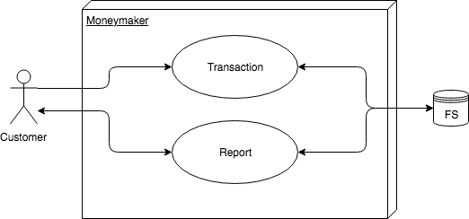
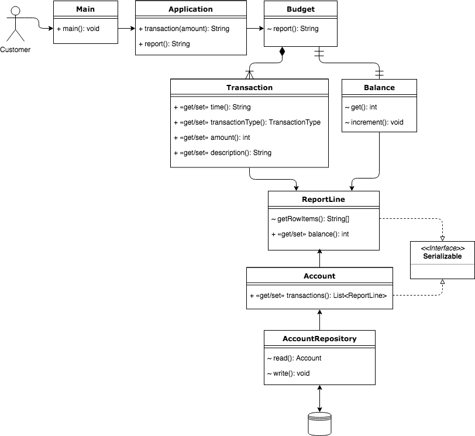

# Engineering design

This document seeks to convey how the commands flow through the code, and will highlight the public methods available.
Additionally, the details of external resources will also be given.

The basic outline of the Moneymaker app is as follows:

This shows that a `customer` may use Moneymaker to generate transactions and reports - both of which can be stored in a local filesystem. Furthermore, a report can be generated for the customer to view historic transactions and balance.

In more detail then, the class diagram with public methods of classes is as follows: 

When `Main` is called, it starts the `Application` class, where a choice mey be made to create a `transaction` or a `report` using the eponymous public methods.
When a transaction is made by an `amount`, the application will determine if it is a deposit or withdrawal (inferred via the presence of a negative sign). 
The transaction may include a `time` (in ISO 8601 date format [YYYY-MM-DD]) and a `description`. A running `budget` is then calculated after each transaction.
If a `report` is called for, then the `ReportLine` class will concatenate the Transaction and Balance instances of all transactions and display these in a table.
These transactions are stored as instances of the `Account` class, which implements the `Serializable` interface. The instances of the `Account` class can be read and written from and to the filesystem using the `read` and `write` methods respectively.

