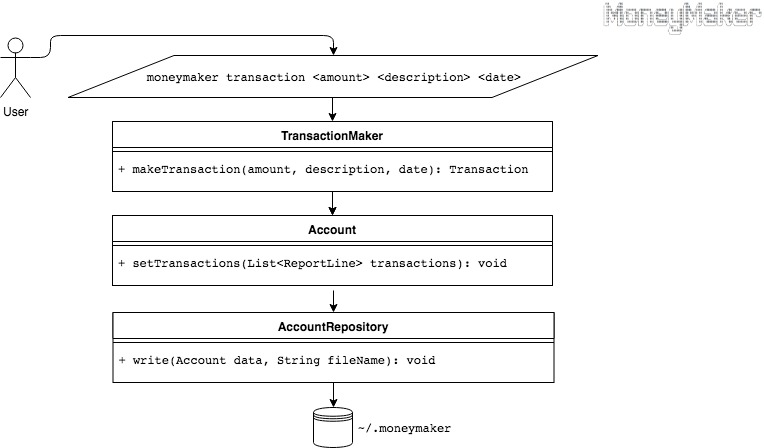
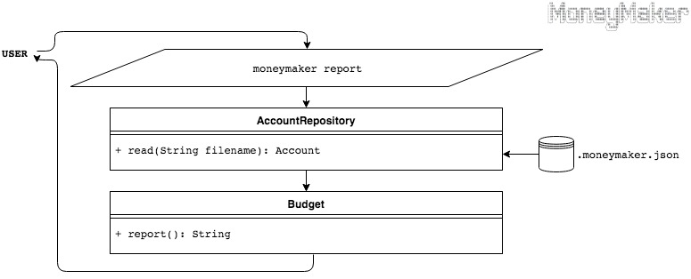

# Engineering design

Please see the accompanying [Product Design](product-design.md).

This document seeks to convey how the commands flow through the code, and will highlight the public methods available.
Additionally, the details of external resources will also be given.

### The basic outline of the Moneymaker app is that a user can:
- make a `transaction`
- generate a `report` to view transactions

#### An overview:
The transactions are stored and retrieved in a JSON format to and from the user’s home directory on their local drive. However, it is the filename that decides which account is being used to store transactions - therefor the system could (out of scope for this design) implement the possibility of allowing the user to choose the account, and view all historical transactions. Furthermore, a report can be generated from these stored transactions for the user to view historic transactions and their balance. If no choice is made, or an erroneous choice is selected, then the application will print out a help file with the list of commands (out of scope for this design).

## User requesting `transaction`:
When `Main` is called, it starts the `Application` class, where a choice may be made to create a `transaction`. When a transaction is made by an `amount`, the application will infer via the presence of a negative sign if it is a deposit or withdrawal. The transaction **must** include a `description` in quotation marks so as to parse this as the description and to infer the `date` component of the command. The command may finally include a `date` (in ISO 8601 date format [YYYY-MM-DD]) - but if this is not given then the application will automatically register the transaction as taking place on the day that the command was given.

#### An example transaction:
`moneymaker transaction 200 "New watch" 2018-09-26`
Notice that this follows the command format `moneymaker transaction [<amount>][<description>][<date>]`, and that the description **must** be included and in quotation marks, and that the date **must** include the hyphenation in order to be parsed.

A diagram that illustrates the logic flow when a user records a transaction is as follows:


## User requesting `report`:

The `report` command will display all historic transactions formatted in a table with headings.

The diagram that displays the logic flow when the user requests a report is as follows:


## The file format of the stored transactions
The JSON files are sored in the user’s home directory at the following locations: 
- For MacOS and Linux: `~/.moneymaker.json` 
- For Windows: `C:\Users\Home\.moneymaker.json`

#### An example of a stored account will follow this structure:
```JSON
{
"Date" : "2019/03/03",
"TransactionType" : "CREDIT",
"Amount": 100,
"Balance": 200,
"Description": "Got paid"
}
```